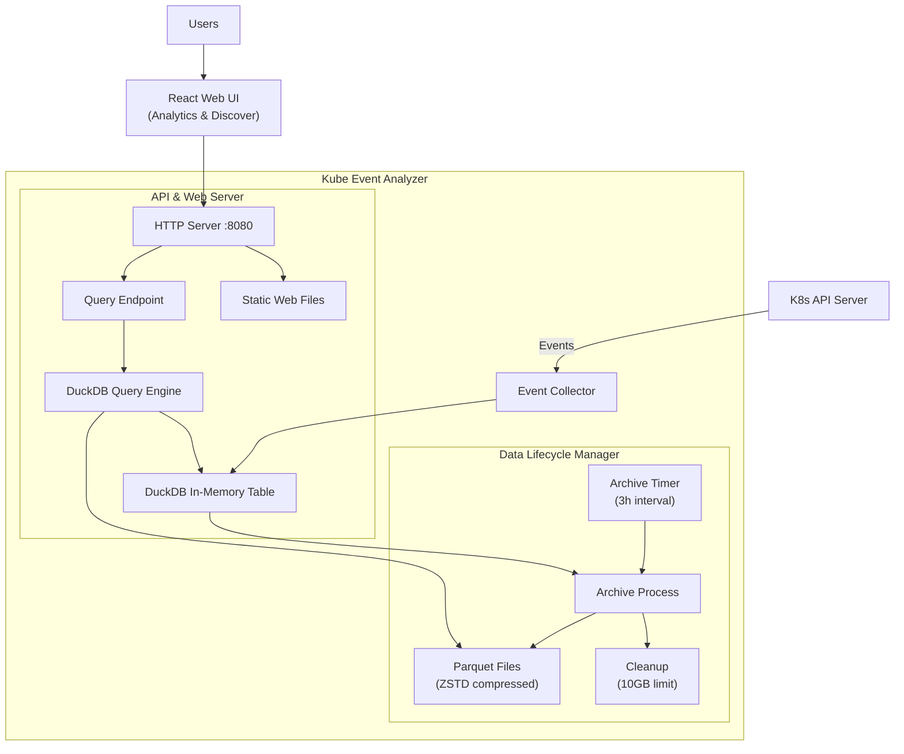

# Kube Event Analyzer

Kube Event Analyzer is a standalone, lightweight tool designed to efficiently collect, store, and analyze Kubernetes events. It provides an alternative to complex and heavy solutions like the ELK stack, offering a simple, single-binary solution with a powerful web interface perfect for clusters of all sizes.

## The Problem

Monitoring Kubernetes events is crucial for maintaining cluster health. However, traditional methods often fall short:

1.  **High Latency**: Relying on centralized logging pipelines (e.g., shipping to a shared Elasticsearch) can introduce significant delays (15+ minutes), making real-time analysis impossible.
2.  **Operational Overhead**: Setting up and maintaining a full-blown logging pipeline for smaller or temporary clusters is often impractical and costly.
3.  **Lack of Standardization**: Each organization builds its own custom dashboards and queries, leading to a fragmented and inconsistent monitoring experience across the community.

## Our Solution

Kube Event Analyzer addresses these problems with a streamlined, all-in-one approach:

- **Real-Time Collection**: Uses the Kubernetes `WATCH` API to subscribe to events directly, ensuring minimal latency.
- **Efficient Storage**: Events are initially stored in an in-memory DuckDB database for fast ingestion. They are then periodically archived into compressed Parquet files (`zstd` compression) for long-term storage, offering a great balance between performance and disk space.
- **Automated Data Lifecycle**: The tool automatically manages data retention. It archives recent events into Parquet files at a configurable interval and prunes the oldest files when a predefined storage limit is reached.
- **Simplified Architecture**: Runs as a single binary, containing both the event collector and API server for querying data. This eliminates the need for external databases or complex pipelines.
- **Powerful Analytics**: By leveraging DuckDB, it can query both the real-time in-memory data and the historical Parquet files simultaneously, providing a unified view for analysis.
- **Rich Web Interface**: Features a modern, responsive React-based web UI with real-time dashboards, advanced query builder, and interactive visualizations.

## Architecture

The project is a single Go binary that consists of three main components:

1.  **Collector & Storage Manager**: A background service that:

    - Connects to the Kubernetes API server.
    - Uses a `RetryWatcher` to reliably watch for cluster events, automatically resuming from the last known `resourceVersion` upon restart.
    - Appends incoming events to a `kube_events` table in DuckDB.
    - At a regular interval, archives the events from the DuckDB table to a ZSTD-compressed Parquet file using a lock-free table-swapping mechanism.
    - Enforces a storage limit by deleting the oldest Parquet files when the total size exceeds the configured capacity.

2.  **API Server**: A REST API that:
    - Exposes `/query` endpoint to receive SQL queries with time range parameters.
    - Executes queries against DuckDB, combining both real-time in-memory data and historical Parquet files.
    - Provides `/stats` endpoint for system statistics and metrics.
    - Serves the web interface as static files from the embedded filesystem.

3.  **Web Interface**: A modern React-based UI featuring:
    - **Analytics Dashboard**: Real-time insights with event timeline charts, top noisy namespaces, warning reasons, and recent critical events.
    - **Discover Page**: Advanced SQL query builder with syntax highlighting, result tables, and event detail views.
    - **Time Range Management**: Flexible time range selection with URL synchronization and manual refresh controls.
    - **Interactive Visualizations**: ApexCharts-powered timeline charts and responsive Material-UI components.

### Data Flow Diagram



## Project Structure

```
.
├── data/                    # Default directory for DuckDB files and Parquet archives
├── internal/
│   ├── api/                 # API server logic and HTTP handlers
│   ├── collector/           # Kubernetes event collection logic
│   └── storage/             # DuckDB and Parquet storage management
├── src/                     # React frontend source code
│   ├── components/          # Reusable UI components (charts, tables, forms)
│   ├── contexts/            # React contexts (theme, refresh)
│   ├── hooks/               # Custom hooks (data fetching, URL params)
│   ├── pages/               # Main application pages (Insight, Discover)
│   ├── types/               # TypeScript type definitions
│   └── utils/               # Utility functions (time, date handling)
├── public/                  # Static assets
├── dist/                    # Built frontend (embedded in Go binary)
├── Dockerfile               # Multi-stage Docker build
├── DEVELOPMENT_GUIDE_FRONTED.md    # Frontend development guide
├── DEVELOPMENT_QUERY_GUIDE.md      # API and query development guide
├── package.json             # Frontend dependencies and scripts
├── vite.config.ts           # Frontend build configuration
├── go.mod                   # Go module dependencies
├── go.sum                   # Go module checksums
└── main.go                  # Application entrypoint
```

## Getting Started

### Prerequisites

- Go 1.24+
- Node.js 18+ (for frontend development)
- Access to a Kubernetes cluster (a valid `kubeconfig` file)
- DuckDB (automatically installed in Docker builds)

### Development Setup

1.  **Install dependencies**:
    ```bash
    # Install Go dependencies
    go mod download
    
    # Install frontend dependencies
    npm install
    ```

2.  **Run in development mode**:
    ```bash
    # Terminal 1: Start the frontend dev server
    npm run dev
    
    # Terminal 2: Start the Go backend
    go run main.go
    ```
    
    - Frontend will be available at `http://localhost:5173`
    - Backend API will be available at `http://localhost:8080`
    - The dev server proxies API calls to the backend

3.  **Build for production**:
    ```bash
    # Build the frontend
    npm run build
    
    # Build the Go binary (includes embedded frontend)
    go build -o kube-event-analyzer main.go
    
    # Run the production binary
    ./kube-event-analyzer
    ```

### Docker Deployment

```bash
# Build the Docker image
docker build -t kube-event-analyzer .

# Run with persistent data storage
docker run -d \
  --name kube-event-analyzer \
  -p 8080:8080 \
  -v ~/.kube/config:/root/.kube/config:ro \
  -v $(pwd)/data:/data \
  kube-event-analyzer
```

### Access the Web Interface

Once running, open your browser to `http://localhost:8080` to access:

- **Analytics Dashboard** (`/`): Real-time insights and visualizations
- **Discover Page** (`/discover`): SQL query builder and event exploration

## Key Features

### **Real-Time Event Collection**
- Watches Kubernetes events using the efficient `WATCH` API
- Automatic recovery from connection interruptions with resource version tracking
- Zero data loss with robust error handling and retry mechanisms

### **Rich Analytics Dashboard**
- **Event Timeline Charts**: Interactive visualizations of event patterns over time
- **Top Noisy Namespaces**: Identify the most active namespaces in your cluster
- **Warning Analysis**: Breakdown of warning reasons and their frequencies
- **Recent Critical Events**: Quick access to the latest critical incidents
- **Metrics Overview**: Key statistics and health indicators

### **Advanced Query Interface**
- **SQL Query Builder**: Write custom SQL queries with full DuckDB syntax support
- **Time Range Controls**: Flexible date/time pickers with preset quick ranges
- **Interactive Results**: Click on events to view detailed information in a drawer
- **URL Synchronization**: Share queries and results via URL parameters
- **Real-time Filtering**: Dynamic event filtering and searching

### **Intelligent Storage Management**
- **Hybrid Storage**: Fast in-memory DuckDB for recent data, compressed Parquet for archives
- **Automatic Archiving**: Configurable intervals for data lifecycle management (default: 3 hours)
- **Space Management**: Automatic cleanup when storage limits are reached (default: 10GB)
- **ZSTD Compression**: Efficient compression for long-term storage

### **Developer-Friendly**
- **Modern Tech Stack**: React, TypeScript, Material-UI, SWR for data fetching
- **Comprehensive Guides**: Detailed development documentation for both frontend and backend
- **Docker Support**: Multi-stage builds for easy deployment
- **API-First Design**: RESTful API with JSON responses for integration

## API Reference

### Query Endpoint: `POST /query`

The primary API endpoint accepts SQL queries with time range parameters. The `$events` table represents all Kubernetes events within the specified time range, combining both real-time in-memory data and historical Parquet files.

**Request Format:**
```json
{
  "query": "SQL_QUERY",
  "start": "2025-01-01T00:00:00Z",
  "end": "2025-01-02T00:00:00Z"
}
```

**Response Format:**
```json
{
  "results": [...],
  "duration_ms": 45,
  "files": [...],
  "total_files_size_bytes": 12345678
}
```

### Example: Top Event Reasons

```bash
curl -X POST http://localhost:8080/query \
-H "Content-Type: application/json" \
-d '{
    "query": "SELECT reason, COUNT(*) as count FROM $events GROUP BY reason ORDER BY count DESC LIMIT 5",
    "start": "2025-01-01T00:00:00Z",
    "end": "2026-01-02T00:00:00Z"
}'
```

**Response:**
```json
{
  "results": [
    {"reason": "FailedScheduling", "count": 717},
    {"reason": "Scheduled", "count": 629},
    {"reason": "Pulling", "count": 564},
    {"reason": "Pulled", "count": 550},
    {"reason": "Started", "count": 445}
  ],
  "duration_ms": 23,
  "files": ["events_2025-01-01_12-00-00.parquet"],
  "total_files_size_bytes": 2097152
}
```

### Additional Endpoints

- `GET /stats` - System statistics and metrics
- `GET /` - Web interface (Analytics Dashboard)
- `GET /discover` - Query builder interface

For detailed query examples and advanced usage, see `DEVELOPMENT_QUERY_GUIDE.md`.

## Development

This project welcomes contributions! Here are some helpful resources:

- **Frontend Development**: See `DEVELOPMENT_GUIDE_FRONTED.md` for React/TypeScript development
- **Query Development**: See `DEVELOPMENT_QUERY_GUIDE.md` for API usage and SQL examples
- **Architecture**: The codebase is well-structured with clear separation between collector, storage, API, and frontend
- **Testing**: Run `npm run lint` for frontend linting and `go test ./...` for backend tests

### Tech Stack Summary

**Backend (Go):**
- Kubernetes client-go for API interactions
- DuckDB for high-performance analytics
- Standard HTTP server with embedded static files

**Frontend (React/TypeScript):**
- Vite for fast development and building
- Material-UI for consistent, modern UI components
- SWR for efficient data fetching and caching
- ApexCharts for interactive visualizations
- Wouter for lightweight client-side routing

## Event Schema Reference

```sql
CREATE TABLE $events (
	-- From metav1.TypeMeta (inlined)
	kind VARCHAR,
	apiVersion VARCHAR,

	-- From metav1.ObjectMeta
	metadata STRUCT(
		name VARCHAR,
		namespace VARCHAR,
		uid VARCHAR,
		resourceVersion VARCHAR,
		creationTimestamp TIMESTAMP
	),

	-- From corev1.Event
	involvedObject STRUCT(
		kind VARCHAR,
		namespace VARCHAR,
		name VARCHAR,
		uid VARCHAR,
		apiVersion VARCHAR,
		resourceVersion VARCHAR,
		fieldPath VARCHAR
	),
	reason VARCHAR,
	message VARCHAR,
	source STRUCT(
		component VARCHAR,
		host VARCHAR
	),
	firstTimestamp TIMESTAMP,
	lastTimestamp TIMESTAMP,
	"count" INTEGER,
	"type" VARCHAR,
	eventTime TIMESTAMP,
	series STRUCT(
		"count" INTEGER,
		lastObservedTime TIMESTAMP
	) DEFAULT NULL,
	action VARCHAR,
	related STRUCT(
		kind VARCHAR,
		namespace VARCHAR,
		name VARCHAR,
		uid VARCHAR,
		apiVersion VARCHAR,
		resourceVersion VARCHAR,
		fieldPath VARCHAR
	) DEFAULT NULL,
	reportingComponent VARCHAR,
	reportingInstance VARCHAR
);
```
