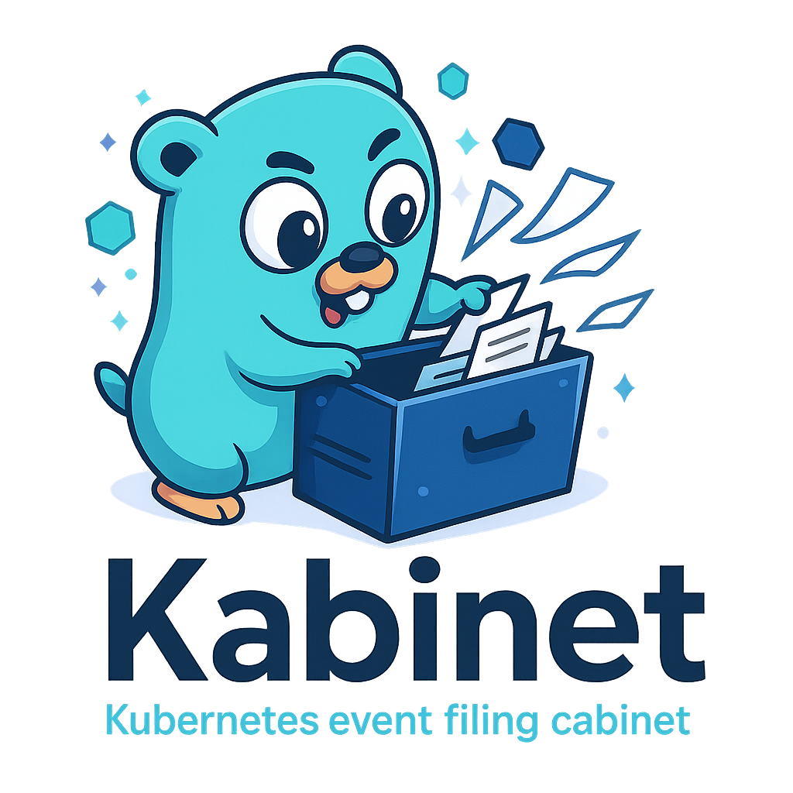
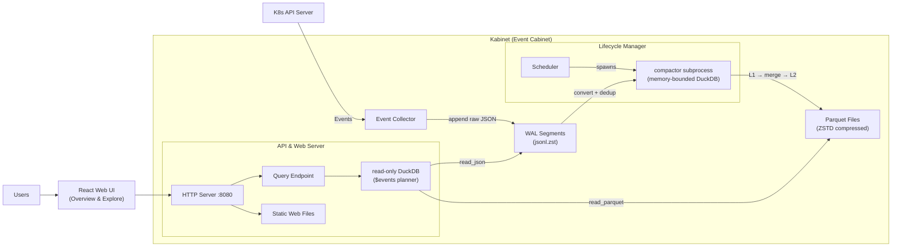

# Kabinet — Kubernetes event filing cabinet

Kabinet is a single-binary "event cabinet" for Kubernetes: it collects cluster events in real time into a compressed write-ahead log, compacts them into deduplicated Parquet files, and lets you explore them on demand with fast DuckDB-powered queries and dashboards.

## The Problem

Monitoring Kubernetes events is crucial for maintaining cluster health. However, traditional methods often fall short:

1.  **High Latency**: Relying on centralized logging pipelines (e.g., shipping to a shared Elasticsearch) can introduce significant delays (15+ minutes), making real-time analysis impossible.
2.  **Operational Overhead**: Setting up and maintaining a full-blown logging pipeline for smaller or temporary clusters is often impractical and costly.
3.  **Lack of Standardization**: Each organization builds its own custom dashboards and queries, leading to a fragmented and inconsistent monitoring experience across the community.

## Our Solution

Kabinet addresses these problems with a streamlined, all-in-one approach:

- **Real-Time Collection**: Uses the Kubernetes `WATCH` API to subscribe to events directly, ensuring minimal latency.
- **Durable Ingestion**: Incoming events are appended as raw JSON to a zstd-compressed JSONL write-ahead log. Every flush is a complete compression frame, so a crash costs at most the last few seconds of unflushed events.
- **Automated Data Lifecycle**: A background scheduler converts WAL segments into ZSTD Parquet files and merges small files into larger ones, deduplicating events on every pass. The heavy work runs in a memory-bounded subprocess so it can never take the server down. Oldest files are pruned when the storage limit is reached.
- **Simplified Architecture**: Runs as a single deployable image, containing the event collector, lifecycle manager, and API server. This eliminates the need for external databases or complex pipelines.
- **Powerful Analytics**: By leveraging DuckDB, every query transparently unions the recent WAL segments with the historical Parquet files, providing a unified view for analysis.
- **Rich Web Interface**: Features a modern, responsive React-based web UI with real-time dashboards, advanced query builder, and interactive visualizations.

## Architecture

The backend is split into three strictly separated layers that communicate only through immutable files on disk:

1.  **Ingest (WAL)**: A background service that:
    - Connects to the Kubernetes API server and watches cluster events with the `client-go` informer framework (including in-place event updates).
    - Appends raw event JSON to zstd-compressed JSONL segment files (`data/wal/`), one complete compression frame per batch flush.
    - Rotates segments by time/size and seals them with an atomic rename; torn tails from a crash are truncated at recovery.

2.  **Manage (Lifecycle + Compactor)**: A scheduler that:
    - Converts sealed WAL segments into L1 Parquet files and merges them into larger L2 files (`data/archive/`), deduplicating by `(metadata.uid, metadata.resourceVersion)` on every pass.
    - Runs the heavy conversion in a separate `compactor` subprocess with a DuckDB memory limit, disk spilling, and an RSS watchdog — an out-of-memory situation kills the compactor, never the server.
    - Enforces a storage limit by deleting the oldest Parquet files when the total size exceeds the configured capacity.

3.  **Query (API Server)**: A REST API that:
    - Exposes `/query` endpoint to receive SQL queries with time range parameters.
    - Resolves the `$events` macro into a union of the Parquet files and WAL segments overlapping the requested time range, executed on a read-only in-memory DuckDB.
    - Provides `/stats` endpoint for system statistics and metrics.
    - Serves the web interface as static files from the embedded filesystem.

On top of that sits the **Web Interface**, a React UI built for reviewing ~1M events/day through an aggregate-first funnel:
    - **Overview** (`/`): brushable event timeline, one-query KPI strip, "The Cabinet" namespace×time heatmap, and top-moving reasons vs the previous period — every aggregate is clickable and drills into Explore.
    - **Explore** (`/p/discover`): structured filter chips (with a raw-SQL escape hatch) over a virtualized, infinitely-scrolling event table with keyset pagination, plus a config-driven detail panel.
    - **Agent** (`/agent`): AI investigation via OpenAI tool calling — each SQL query is filed as a numbered exhibit, findings stream in as markdown.
    - **Scan receipt**: every query's cost (duration, files, bytes scanned) is stamped in the footer.
    - **Time Range Management**: flexible relative/absolute ranges synchronized to the URL, with manual refresh.

### Data Flow Diagram


```mermaid
graph LR
    A["K8s API Server"] -- "Events" --> B["Event Collector"]

    subgraph "Kabinet (Event Cabinet)"
        B --"append raw JSON"--> C["WAL Segments<br/>(jsonl.zst)"]

        subgraph "Lifecycle Manager"
            D["Scheduler"] --"spawns"--> E["compactor subprocess<br/>(memory-bounded DuckDB)"]
        end
        C --"convert + dedup"--> E
        E --"L1 → merge → L2"--> F["Parquet Files<br/>(ZSTD compressed)"]

        subgraph "API & Web Server"
            H["HTTP Server :8080"] --> I["Query Endpoint"]
            H --> J["Static Web Files"]
            I --> K["read-only DuckDB<br/>($events planner)"]
        end
        K --"read_json"--> C
        K --"read_parquet"--> F
    end

    L["Users"] --> M["React Web UI<br/>(Overview & Explore)"]
    M --> H
```

## Project Structure

```
.
├── data/                    # Default data directory (wal/, archive/l1, archive/l2, tmp/)
├── cmd/
│   ├── server/              # Main server entrypoint (embeds the frontend)
│   └── compactor/           # Compaction subprocess entrypoint
├── internal/
│   ├── api/                 # API server logic and HTTP handlers
│   ├── collector/           # Kubernetes event collection logic
│   ├── schema/              # Canonical event schema (projection & dedup SQL)
│   ├── wal/                 # Write-ahead log: segments, sealing, crash recovery
│   ├── catalog/             # In-memory index of archived Parquet files
│   ├── compact/             # Convert/merge job execution + OOM guard
│   ├── lifecycle/           # Compaction scheduling and retention
│   └── query/               # $events planning and query execution
├── src/                     # React frontend source code
│   ├── styles/              # Design tokens (CSS custom properties) + global styles
│   ├── ui/                  # Custom component primitives (CSS Modules)
│   ├── lib/                 # API client, filter model/compiler, SQL builders, agent
│   ├── components/          # Feature components (charts, explore, overview, agent)
│   ├── contexts/            # React contexts (theme, refresh)
│   ├── hooks/               # Custom hooks (data fetching, filters, URL params)
│   ├── stores/              # Zustand store (query scan-cost telemetry)
│   ├── pages/               # Main application pages (Overview, Explore, Agent)
│   ├── types/               # TypeScript type definitions
│   └── utils/               # Utility functions (time, formatting)
├── public/                  # Static assets
├── dist/                    # Built frontend (embedded in Go binary)
├── Dockerfile               # Multi-stage Docker build
├── DEVELOPMENT_GUIDE_FRONTED.md    # Frontend development guide
├── DEVELOPMENT_QUERY_GUIDE.md      # API and query development guide
├── package.json             # Frontend dependencies and scripts
├── vite.config.ts           # Frontend build configuration
├── go.mod                   # Go module dependencies
└── go.sum                   # Go module checksums
```

## Getting Started

### Prerequisites

- Go 1.25+ (CGO enabled — DuckDB is embedded via `go-duckdb`)
- Node.js 22+ (for frontend development)
- Access to a Kubernetes cluster (a valid `kubeconfig` file)

### Development Setup

1.  **Install dependencies**:

    ```bash
    # Install Go dependencies
    go mod download

    # Install frontend dependencies
    npm install
    ```

2.  **Run in development mode**:

    ```bash
    # Terminal 1: Start the frontend dev server
    npm run dev

    # Terminal 2: Start the Go backend
    go run ./cmd/server/main.go
    ```

    - Frontend will be available at `http://localhost:5173`
    - Backend API will be available at `http://localhost:8080`
    - The dev server proxies API calls to the backend

3.  **Build for production**:

    ```bash
    # Build the frontend and place it where go:embed expects it
    npm run build
    cp -r dist/ cmd/server/dist/

    # Build the binaries (server embeds the frontend)
    go build -o kabinet ./cmd/server/main.go
    go build -o compactor ./cmd/compactor/main.go

    # Run the production binary (finds `compactor` next to itself or on PATH)
    ./kabinet
    ```

### Docker Deployment

The application can be configured via environment variables. See the **Configuration** section below for details.

```bash
# Build the Docker image
docker build -t kabinet .

# Run with persistent data storage and custom configuration
docker run -d \
  --name kabinet \
  -p 8080:8080 \
  -e STORAGE_LIMIT_GB=10 \
  -v ~/.kube/config:/root/.kube/config:ro \
  -v $(pwd)/data:/data \
  kabinet
```

### Access the Web Interface

Once running, open your browser to `http://localhost:8080` to access:

- **Overview** (`/`): aggregate insights — timeline, KPIs, namespace heatmap, top movers
- **Namespaces / Nodes / Components** (`/p/namespaces`, `/p/nodes`, `/p/components`): per-dimension event/warning counts with trend sparklines
- **Explore** (`/p/discover`): filter-driven event exploration with infinite scroll
- **Agent** (`/agent`): AI-powered event investigation

## Key Features

### **High Reliability**

- Reliably watches Kubernetes events using the `client-go` informer framework, which automatically handles reconnections and resynchronization.
- Crash-safe ingestion: every WAL flush is a complete zstd frame, and recovery truncates a torn tail instead of losing the segment. Duplicates caused by informer relists are removed at compaction time.
- Features graceful shutdown to ensure all in-flight events are flushed and the active segment is sealed before the application terminates.

### **Aggregate-First Analytics**

- **Brushable Timeline**: stacked Normal/Warning histogram — drag or click to zoom the global time range
- **The Cabinet**: namespace × time heatmap (intensity = volume, hue = warning ratio) — click a cell to open that drawer in Explore
- **Top Movers**: reason counts vs the previous period, with new/rising/falling badges
- **One-Query KPI Strip**: all headline numbers from a single scan, each clickable into a pre-filtered Explore view

### **Scalable Event Exploration**

- **Filter Chips + Raw SQL**: structured, escaped filters compiled to WHERE clauses, with a full DuckDB SQL escape hatch
- **Virtualized Infinite Scroll**: keyset pagination (timestamp + uid cursor) streams through millions of events without LIMIT walls
- **Config-Driven Detail Panel**: every field value is click-to-filter
- **URL Synchronization**: time range, filters, sort, and selection are all shareable via URL
- **Scan Receipt**: each query's duration, files, and bytes scanned shown in the footer

### **Intelligent Storage Management**

- **Tiered Storage**: Recent data lives in zstd-compressed JSONL WAL segments; history is compacted into L1 and then merged L2 Parquet files
- **Automatic Compaction**: WAL segments convert to Parquet when the backlog exceeds 32MB or the compaction interval; small Parquet files merge once they reach the merge target, deduplicating on every pass
- **Memory-Safe**: Compaction runs in a subprocess with a DuckDB memory limit, disk spilling, and an RSS watchdog — it can be OOM-killed without affecting the server
- **Space Management**: Automatic cleanup when storage limits are reached (default: 10GB)
- **ZSTD Compression**: Efficient compression for long-term storage (roughly 10x smaller than just storing the raw events)

### **Developer-Friendly**

- **Modern Tech Stack**: React 19, TypeScript, CSS-Modules design system, ECharts, SWR
- **Comprehensive Guides**: Detailed development documentation for both frontend and backend
- **Docker Support**: Multi-stage builds for easy deployment
- **API-First Design**: RESTful API with JSON responses for integration

## API Reference

### Query Endpoint: `POST /query`

The primary API endpoint accepts SQL queries with time range parameters. The `$events` table represents all Kubernetes events within the specified time range, combining recent WAL segments and historical Parquet files.

**Request Format:**

```json
{
  "query": "SQL_QUERY",
  "start": "2025-01-01T00:00:00Z",
  "end": "2025-01-02T00:00:00Z"
}
```

**Response Format:**

```json
{
  "results": [...],
  "duration_ms": 45,
  "files": [...],
  "total_files_size_bytes": 12345678
}
```

### Download Endpoint: `GET /download`

Streams Kubernetes events that match a `WHERE` clause and time range as gzipped JSON Lines in chronological order.

**Query Parameters:**

- `from`: start time (RFC3339)
- `to`: end time (RFC3339)
- `where`: SQL `WHERE` clause applied to `$events`

**Example:**

```bash
curl -L "http://localhost:8080/download?from=2025-01-01T00:00:00Z&to=2025-01-02T00:00:00Z&where=type%20=%20'Warning'" \
  --output events.jsonl.gz
```

The response sets `Content-Type: application/jsonl` and `Content-Encoding: gzip`, and events are ordered by `lastTimestamp`.
The Explore page includes a **Download** button that calls this endpoint with the current filters.

### Example: Top Event Reasons

```bash
curl -X POST http://localhost:8080/query \
-H "Content-Type: application/json" \
-d '{
    "query": "SELECT reason, COUNT(*) as count FROM $events GROUP BY reason ORDER BY count DESC LIMIT 5",
    "start": "2025-01-01T00:00:00Z",
    "end": "2026-01-02T00:00:00Z"
}'
```

**Response:**

```json
{
  "results": [
    { "reason": "FailedScheduling", "count": 717 },
    { "reason": "Scheduled", "count": 629 },
    { "reason": "Pulling", "count": 564 },
    { "reason": "Pulled", "count": 550 },
    { "reason": "Started", "count": 445 }
  ],
  "duration_ms": 23,
  "files": [
    { "path": "data/archive/l2/events_1735689600000_1735732800000_12.parquet", "size": 2097152 }
  ],
  "total_files_size_bytes": 2097152
}
```

### Additional Endpoints

- `GET /stats` - System statistics and metrics
- `GET /metrics` - Prometheus metrics (for scraping)
- `GET /` - Web interface (Overview)
- `GET /p/discover` - Explore (filter-driven event exploration)

For detailed query examples and advanced usage, see `DEVELOPMENT_QUERY_GUIDE.md`.

## Configuration

The application can be configured using the following environment variables:

| Variable                  | Description                                                       | Default | Example       |
| ------------------------- | ----------------------------------------------------------------- | ------- | ------------- |
| `DATA_DIR`                | Root data directory (`wal/`, `archive/`, `tmp/` live under it).   | `data`  | `/data`       |
| `STORAGE_LIMIT_GB`        | The maximum total size of the data directory in gigabytes.        | `10`    | `20`          |
| `LISTEN_PORT`             | The port on which the API server will listen.                     | `8080`  | `8888`        |
| `WAL_ROTATE_SECONDS`      | Max age of the active WAL segment before it is sealed.            | `60`    | `30`          |
| `WAL_ROTATE_MB`           | Max size of the active WAL segment before it is sealed.           | `8`     | `16`          |
| `COMPACT_INTERVAL_SECONDS`| Max time sealed segments wait before conversion to Parquet.       | `600`   | `300`         |
| `COMPACT_MEMORY_LIMIT_MB` | DuckDB memory limit for the compactor subprocess.                 | `512`   | `1024`        |
| `MERGE_TARGET_MB`         | Combined L1 size that triggers a merge into one L2 file.          | `128`   | `256`         |
| `KABINET_COMPACTOR_PATH`  | Explicit path to the `compactor` binary.                          | (auto)  | `/opt/compactor` |

## Development

This project welcomes contributions! Here are some helpful resources:

- **Frontend Development**: See `DEVELOPMENT_GUIDE_FRONTED.md` for React/TypeScript development
- **Query Development**: See `DEVELOPMENT_QUERY_GUIDE.md` for API usage and SQL examples
- **Architecture**: The codebase is well-structured with clear separation between collector, storage, API, and frontend
- **Testing**: Run `npm run lint` for frontend linting and `go test ./...` for backend tests

### Tech Stack Summary

**Backend (Go):**

- Kubernetes client-go for API interactions
- DuckDB for high-performance analytics
- Standard HTTP server with embedded static files

**Frontend (React/TypeScript):**

- Vite for fast development and building
- Custom design-token component system (CSS Modules, light/dark themes)
- SWR for data fetching and caching, swr/infinite for keyset pagination
- Apache ECharts (canvas, tree-shaken) for visualizations
- react-virtuoso for table virtualization
- Wouter for lightweight client-side routing

## Event Schema Reference

Events are stored on disk as raw Kubernetes Event JSON and projected into this canonical schema at read time (see `internal/schema`). Missing `firstTimestamp`/`lastTimestamp` values are backfilled from `metadata.creationTimestamp`, and a missing `count` becomes `1`.

```sql
-- Columns of $events
kind VARCHAR,
apiVersion VARCHAR,

-- From metav1.ObjectMeta
metadata STRUCT(
	name VARCHAR,
	namespace VARCHAR,
	uid VARCHAR,
	resourceVersion VARCHAR,
	creationTimestamp TIMESTAMPTZ
),

-- From corev1.Event
involvedObject STRUCT(
	kind VARCHAR,
	namespace VARCHAR,
	name VARCHAR,
	uid VARCHAR,
	apiVersion VARCHAR,
	resourceVersion VARCHAR,
	fieldPath VARCHAR
),
reason VARCHAR,
message VARCHAR,
source STRUCT(
	component VARCHAR,
	host VARCHAR
),
firstTimestamp TIMESTAMPTZ,
lastTimestamp TIMESTAMPTZ,
"count" INTEGER,
"type" VARCHAR,
eventTime TIMESTAMPTZ,
series STRUCT(
	"count" INTEGER,
	lastObservedTime TIMESTAMPTZ
),
action VARCHAR,
related STRUCT(
	kind VARCHAR,
	namespace VARCHAR,
	name VARCHAR,
	uid VARCHAR,
	apiVersion VARCHAR,
	resourceVersion VARCHAR,
	fieldPath VARCHAR
),
reportingComponent VARCHAR,
reportingInstance VARCHAR
```
