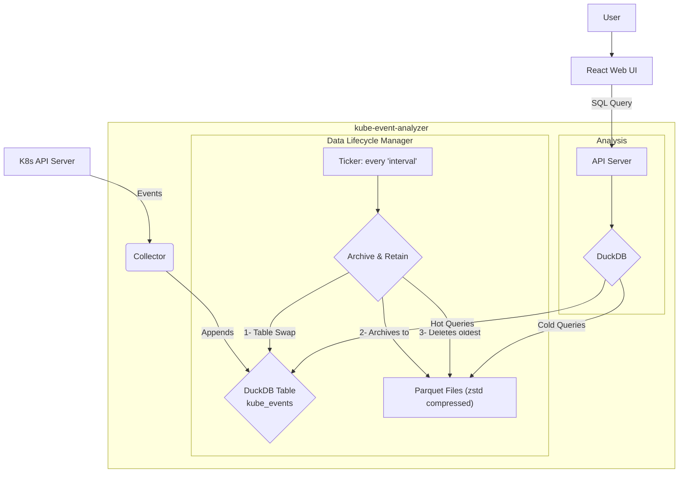

# Kube Event Analyzer

Kube Event Analyzer is a standalone, lightweight tool designed to efficiently collect, store, and analyze Kubernetes events. It provides an alternative to complex and heavy solutions like the ELK stack, offering a simple, single-binary solution perfect for clusters of all sizes.

## The Problem

Monitoring Kubernetes events is crucial for maintaining cluster health. However, traditional methods often fall short:

1.  **High Latency**: Relying on centralized logging pipelines (e.g., shipping to a shared Elasticsearch) can introduce significant delays (15+ minutes), making real-time analysis impossible.
2.  **Operational Overhead**: Setting up and maintaining a full-blown logging pipeline for smaller or temporary clusters is often impractical and costly.
3.  **Lack of Standardization**: Each organization builds its own custom dashboards and queries, leading to a fragmented and inconsistent monitoring experience across the community.

## Our Solution

Kube Event Analyzer addresses these problems with a streamlined, all-in-one approach:

-   **Real-Time Collection**: It uses the Kubernetes `WATCH` API to subscribe to events directly, ensuring minimal latency.
-   **Efficient Storage**: Events are initially stored in an in-memory DuckDB database for fast ingestion. They are then periodically archived into compressed Parquet files (`zstd` compression) for long-term storage, offering a great balance between performance and disk space.
-   **Automated Data Lifecycle**: The tool automatically manages data retention. It archives recent events into Parquet files at a configurable interval and prunes the oldest files when a predefined storage limit is reached.
-   **Simplified Architecture**: It runs as a single binary, containing both the event collector and a future API server for querying data. This eliminates the need for external databases or complex pipelines.
-   **Powerful Analytics**: By leveraging DuckDB, it can query both the real-time in-memory data and the historical Parquet files simultaneously, providing a unified view for analysis.

## Architecture

The project is a single Go binary that consists of two main components:

1.  **Collector & Storage Manager**: A background service that:
    -   Connects to the Kubernetes API server.
    -   Uses a `RetryWatcher` to reliably watch for cluster events, automatically resuming from the last known `resourceVersion` upon restart.
    -   Appends incoming events to a `kube_events` table in DuckDB.
    -   At a regular interval, archives the events from the DuckDB table to a ZSTD-compressed Parquet file using a lock-free table-swapping mechanism.
    -   Enforces a storage limit by deleting the oldest Parquet files when the total size exceeds the configured capacity.

2.  **API Server & Web UI (Future Work)**:
    -   An API endpoint will be exposed to receive SQL queries.
    -   These queries will be executed by DuckDB against the collection of Parquet files and the current in-memory database.
    -   A React-based web interface will be built to provide a powerful query builder and visualization dashboards for operators.

### Data Flow Diagram



## Project Structure

```
.
├── data/                  # Default directory for DuckDB files and Parquet archives
├── internal/
│   ├── api/               # API server logic (includes web UI serving)
│   ├── collector/         # Kubernetes event collection logic
│   └── storage/           # DuckDB and Parquet storage management
├── frontend/              # React frontend application
│   ├── src/
│   │   ├── components/    # React components
│   │   ├── hooks/         # Custom React hooks
│   │   ├── types/         # TypeScript type definitions
│   │   └── utils/         # Utility functions
│   ├── dist/              # Built frontend files (served by Go server)
│   └── package.json
├── go.mod
├── go.sum
└── main.go                # Application entrypoint
```

## Getting Started

1.  **Prerequisites**:
    -   Go 1.24+
    -   Node.js 18+ and npm
    -   Access to a Kubernetes cluster (a valid `kubeconfig` file)

2.  **Build Frontend**:
    
    ```shell
    cd frontend
    npm install
    npm run build
    cd ..
    ```

3.  **Build & Run**:
    
    ```shell
    # Build the application
    go build -o kube-event-analyzer .
    
    # Run the application
    ./kube-event-analyzer
    ```

4.  **Access the Web UI**:
    
    Open your browser and navigate to `http://localhost:8080`
    
    The web interface provides:
    - Real-time cluster event monitoring dashboard
    - Interactive time range selection
    - Event severity analysis with color-coded indicators
    - Namespace-based event filtering
    - Time-series charts showing event trends
    - Detailed event tables with search and filtering capabilities

## Web UI Features

The web interface is built with React and TypeScript, featuring a modern Twitter-inspired design language:

- **Dashboard Overview**: Key metrics cards showing total events, normal events, warnings, and critical events
- **Time-series Visualization**: Interactive charts showing event patterns over time
- **Event Analysis**: Breakdown by event type, namespace, and severity
- **Real-time Updates**: Configurable time ranges (1 hour, 6 hours, 24 hours, 3 days, 1 week)
- **Responsive Design**: Works seamlessly on desktop and mobile devices

## Development

To run the frontend in development mode:

```shell
cd frontend
npm run dev
```

This will start the Vite development server on `http://localhost:3000` with hot reload enabled.

## API Example

`$events` is a macro of all the events in the time range.

```shell
curl -X POST http://localhost:8080/query \
-H "Content-Type: application/json" \
-d '{
    "query": "SELECT reason, COUNT(*) as count FROM $events GROUP BY reason ORDER BY count DESC",
    "start": "2025-01-01T00:00:00Z",
    "end": "2026-01-02T00:00:00Z"
}'
```

```json
{
  "results": [
    {
      "count": 717,
      "reason": "FailedScheduling"
    },
    {
      "count": 629,
      "reason": "Scheduled"
    },
    {
      "count": 564,
      "reason": "Pulling"
    },
    {
      "count": 550,
      "reason": "Pulled"
    },
  ]
}
```

Table schema:

```sql
CREATE TABLE $events (
	-- From metav1.TypeMeta (inlined)
	kind VARCHAR,
	apiVersion VARCHAR,

	-- From metav1.ObjectMeta
	metadata STRUCT(
		name VARCHAR,
		namespace VARCHAR,
		uid VARCHAR,
		resourceVersion VARCHAR,
		creationTimestamp TIMESTAMP
	),

	-- From corev1.Event
	involvedObject STRUCT(
		kind VARCHAR,
		namespace VARCHAR,
		name VARCHAR,
		uid VARCHAR,
		apiVersion VARCHAR,
		resourceVersion VARCHAR,
		fieldPath VARCHAR
	),
	reason VARCHAR,
	message VARCHAR,
	source STRUCT(
		component VARCHAR,
		host VARCHAR
	),
	firstTimestamp TIMESTAMP,
	lastTimestamp TIMESTAMP,
	"count" INTEGER,
	"type" VARCHAR,
	eventTime TIMESTAMP,
	series STRUCT(
		"count" INTEGER,
		lastObservedTime TIMESTAMP
	) DEFAULT NULL,
	action VARCHAR,
	related STRUCT(
		kind VARCHAR,
		namespace VARCHAR,
		name VARCHAR,
		uid VARCHAR,
		apiVersion VARCHAR,
		resourceVersion VARCHAR,
		fieldPath VARCHAR
	) DEFAULT NULL,
	reportingComponent VARCHAR,
	reportingInstance VARCHAR
);
```